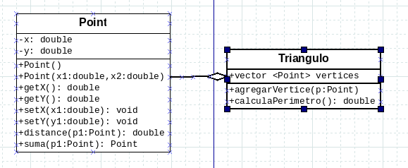
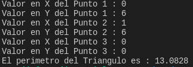

# Tarea 1 : C++ OOP  

------

Genera los archivos .h y .cpp de las clases : Point y Triángulo

De igual forma crea main.cpp que tendrá el método main que usará las clases anteriores

El programa debe de agregar los 3 puntos al triángulo y después desplegar el perímetro

A continuación se muestra una ejemplo de la corrida

Para agregar los valores x , y **debe de hacerse** dentro de un ciclo.