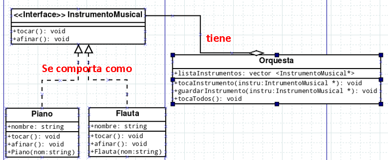
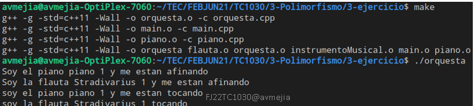

# Tarea Polimorfismo

Usando el siguiente diagrama de clases escriba el código que resuelva el problema de tener una Orquesta con diferentes instrumentos musicales

Esta es la salida que debe de tener su programa

